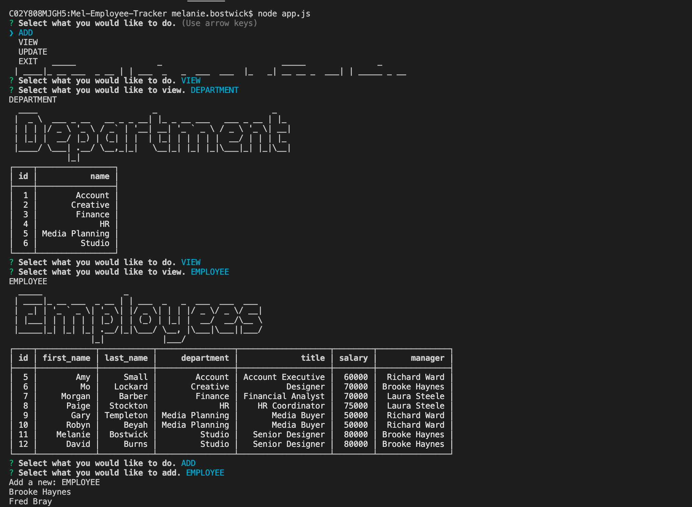
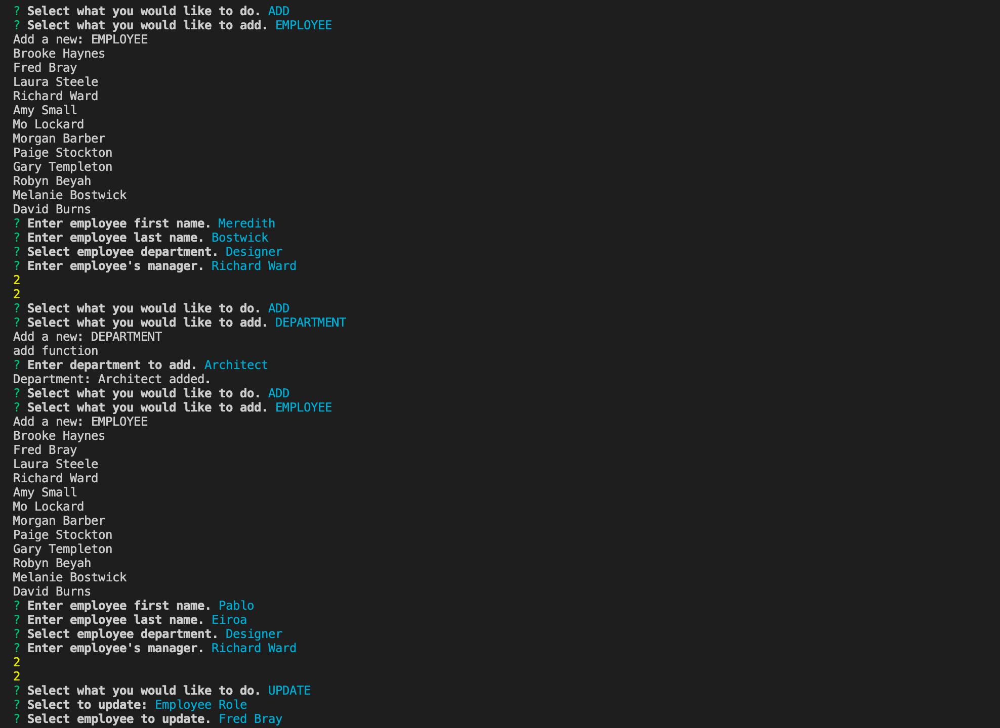
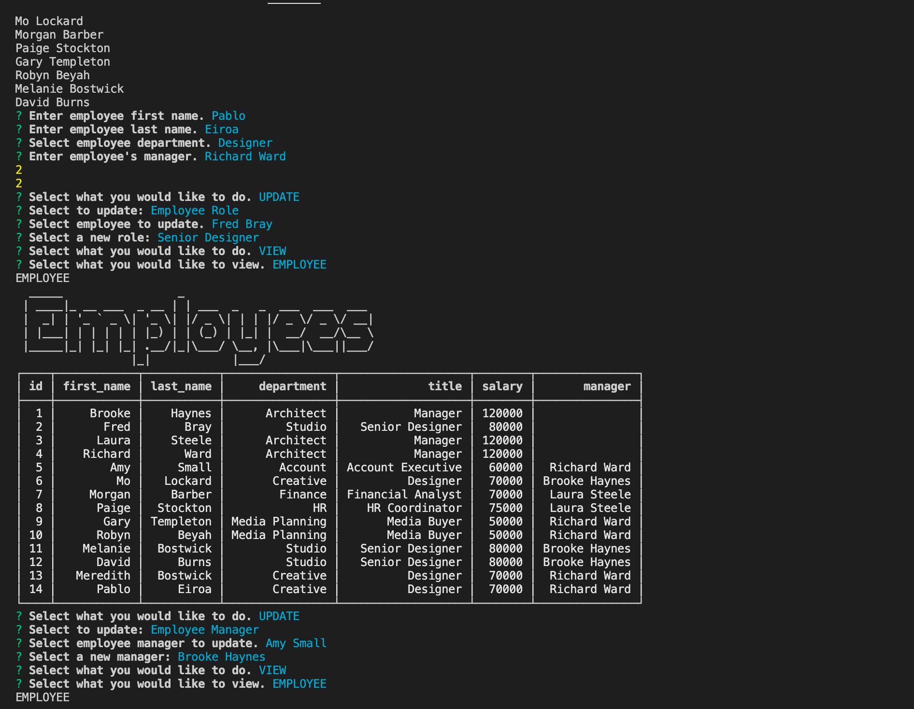
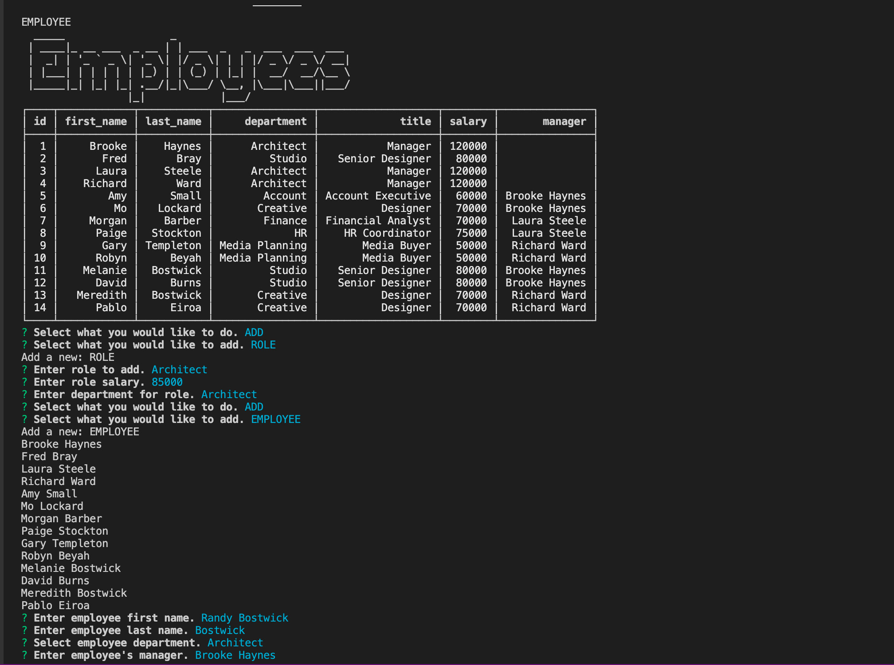
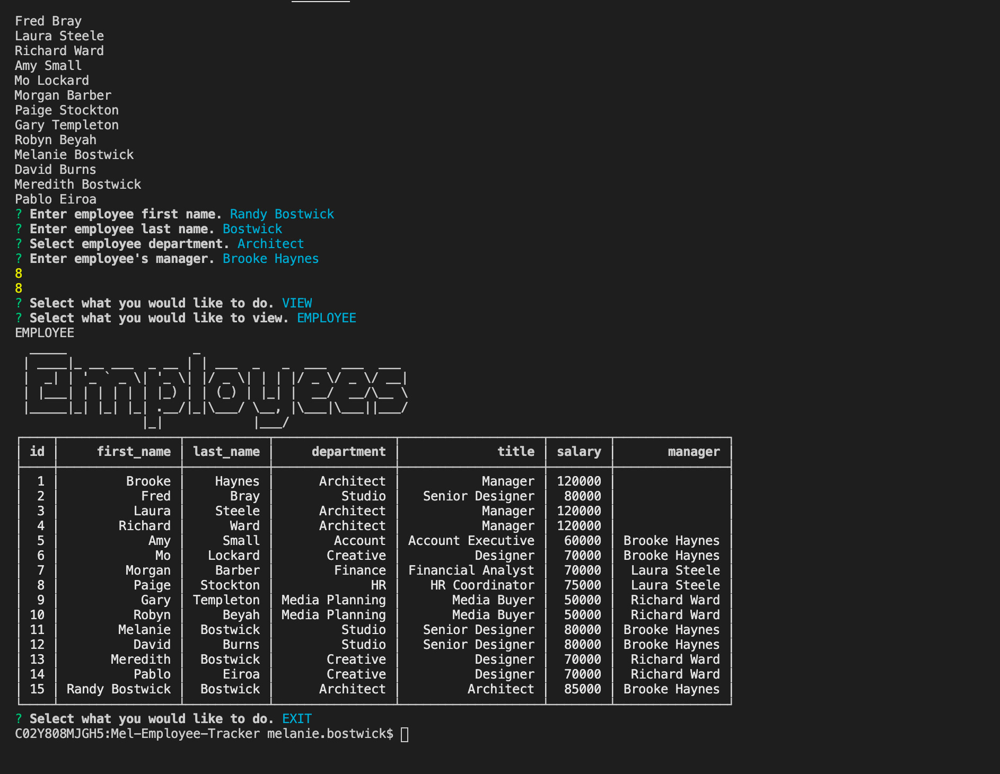

# Mel-Employee-Tracker

## Table of Contents

* [Objective](#Objective)
* [Description](#Description)
* [Installation](#Installation)
* [Usage](#usage)
* [Credits](#credits)

 ## Objective
 
 - Create an employee content management system using inquirer, mySQL, and node.
 
 ## Description
 
 [GitHub](https://github.com/mbostwick1/Mel-Employee-Tracker)
  
 - This system allows the user to add, view, and update company employees, their managers, departments and roles.
 
  ## Installation

- Use node index.js in terminal and follow prompted questions to use the employee database.

 ## Usage

## Credits
N/A

